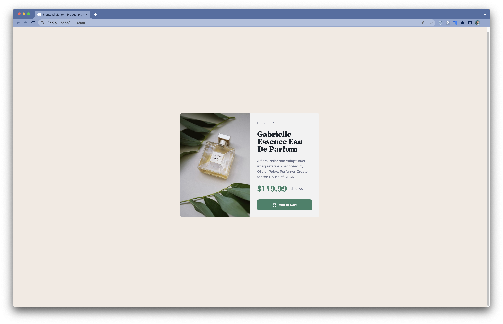

# Frontend Mentor - Product preview card component solution

This is a solution to the [Product preview card component challenge on Frontend Mentor](https://www.frontendmentor.io/challenges/product-preview-card-component-GO7UmttRfa). Frontend Mentor challenges help you improve your coding skills by building realistic projects.

## Table of contents

- [Overview](#overview)
  - [The challenge](#the-challenge)
  - [Screenshot](#screenshot)
  - [Links](#links)
- [My process](#my-process)
  - [Built with](#built-with)
  - [Continued development](#continued-development)
- [Author](#author)
- [Acknowledgments](#acknowledgments)

## Overview

### The challenge

Users should be able to:

- View the optimal layout depending on their device's screen size
- See hover and focus states for interactive elements

### Screenshot

### Links

- Solution URL: [Solution](https://www.frontendmentor.io/solutions/responsive-product-preview-card-component-using-flexbox-8Lj0TVGs_s)
- Live Site URL: [https://unhommequidort.github.io/product-preview/](https://unhommequidort.github.io/product-preview/)

## My process

### Built with

- Semantic HTML5 markup
- CSS custom properties
- Flexbox
- Mobile-first workflow

### Continued development

I'm still getting a handle on images with regard to accessibility. Should I have used background images instead of img tags? What does that do for accessibility? I went about this naively, so I'm sure I have some superfluous and redundant html and css.

## Author

- Frontend Mentor - [@unhommequidort](https://www.frontendmentor.io/profile/unhommequidort)
